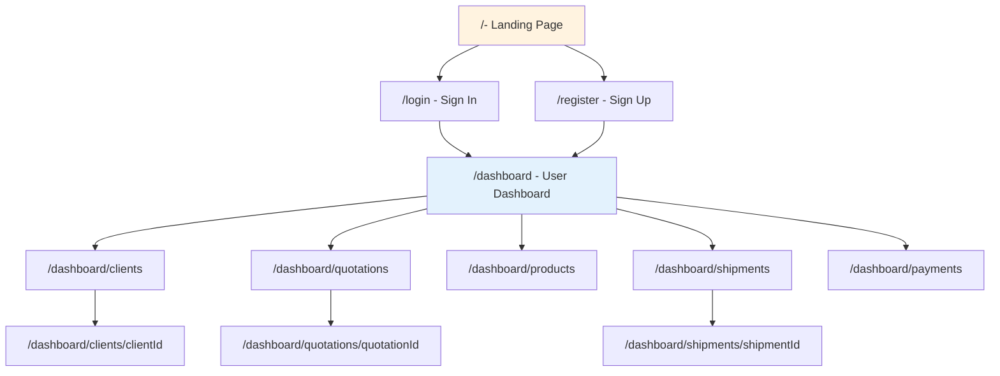
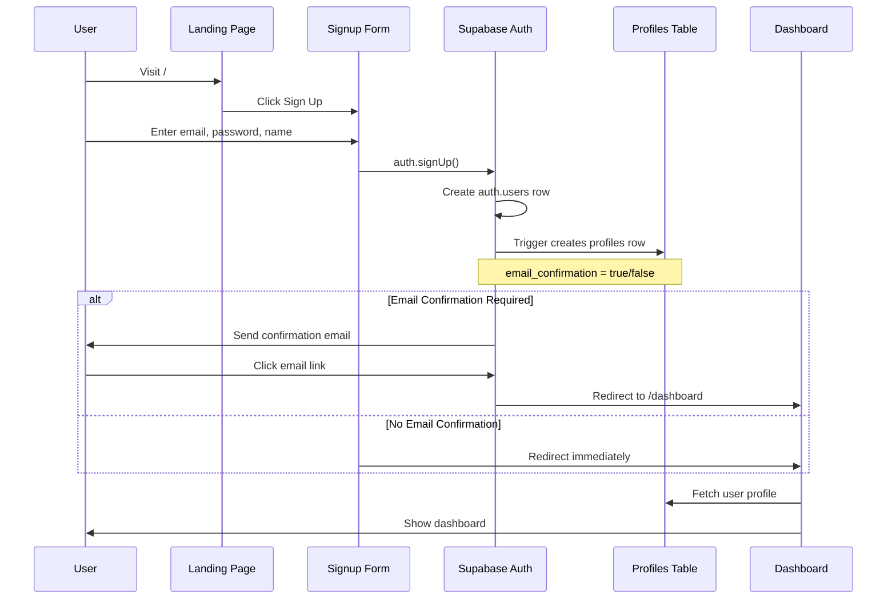

# SourSync User Dashboard - Complete Implementation Plan

## 1. High-Level Architecture

### System Overview

You have an **admin dashboard** at `/admin` (or similar) where you see all data. This plan adds a **user-facing dashboard** at `/dashboard` where each sourcing agent sees only their own data.



### Data Scoping Strategy

**Simple User-ID Model** (Recommended for MVP):

- Every table has `user_id` column
- RLS policies filter: `WHERE user_id = auth.uid()`
- ✅ Simple to implement and understand
- ✅ Fast queries with proper indexes
- ✅ Clear ownership model
- ⚠️ Limitation: One user cannot collaborate with another

**Organization/Tenant Model** (For Later):

- Add `organization_id` to tables
- Multiple users can belong to same organization
- Users see data where `organization_id` matches their org
- 🔮 **When to upgrade**: When you need team collaboration, shared clients, or multi-user companies

**Recommendation**: Start with simple user-id model. You can always migrate to org model later by:

1. Adding `organization_id` column
2. Creating one org per user initially
3. Updating RLS policies to check org instead of user

---

### Reusing Existing Tables

Your existing tables can be reused with these modifications:

| Table | Current State | Required Changes |

|-------|---------------|------------------|

| `profiles` | Exists, linked to auth.users | Ensure `id` references `auth.users.id` |

| `clients` | Has `user_id` | Add RLS policies, verify `user_id` FK |

| `quotations` | Needs user scoping | Add `user_id` and/or link via `client_id` |

| `products` | Catalog or user-specific? | Decide: shared catalog vs user products |

| `shipments` | Needs user scoping | Add `user_id` or link via `quotation_id` |

| `payments` | Needs user scoping | Add `user_id` or link via `quotation_id` |

---

## 2. Routing & Pages Structure

### Complete Route Map

```
Public Routes:
├── /                                  Marketing landing page
├── /login                             Sign in page
├── /register                          Sign up page
├── /forgot-password                   Password reset
│
Protected Routes (requires auth):
└── /dashboard                         Overview/home
    ├── /clients                       Clients list
    │   ├── /new                       Add client form
    │   └── /[clientId]                Client detail
    │       └── /edit                  Edit client
    ├── /quotations                    Quotations list
    │   ├── /new                       Create quotation
    │   └── /[quotationId]             Quotation detail
    │       └── /edit                  Edit quotation
    ├── /products                      Products catalog/list
    │   └── /[productId]               Product detail
    ├── /shipments                     Shipments list
    │   └── /[shipmentId]              Shipment detail + tracking
    ├── /payments                      Payments list
    │   └── /[paymentId]               Payment detail
    └── /settings                      User profile settings
```

---

### Page Specifications

#### `/` - Landing Page (PUBLIC)

**Purpose**: Marketing page for sourcing agents

**Components**:

- `LandingNav` - Logo, Login, Sign Up buttons
- `HeroSection` - Main value prop, CTA
- `FeaturesSection` - Client management, quoting, shipment tracking
- `HowItWorksSection` - Onboarding flow
- `TestimonialsSection` - Social proof
- `PricingSection` - Plans (if applicable)
- `CTASection` - Final signup push
- `LandingFooter` - Links, legal

**Data Fetched**: None (static content)

**File Structure**:

```
src/app/
  page.tsx                    (Landing page)
  components/
    landing/
      HeroSection.tsx
      FeaturesSection.tsx
      ...
```

---

#### `/login` - Sign In (PUBLIC)

**Purpose**: User authentication

**Components**:

- `LoginForm` - Email, password fields
- Social auth buttons (optional)
- "Forgot password?" link
- "Don't have account?" → Register link

**Flow**:

```typescript
// Pseudo-code
const handleLogin = async (email, password) => {
  const { data, error } = await supabase.auth.signInWithPassword({ email, password });
  if (error) return showError(error.message);
  
  // Redirect to dashboard
  router.push('/dashboard');
};
```

**Redirects**:

- Already logged in → redirect to `/dashboard`
- After successful login → `/dashboard`

---

#### `/register` - Sign Up (PUBLIC)

**Purpose**: New user registration

**Components**:

- `SignupForm` - Name, email, password, confirm password
- Terms & conditions checkbox
- "Already have account?" → Login link

**Flow**:

```typescript
const handleSignup = async (email, password, fullName) => {
  // 1. Create auth user
  const { data: authData, error } = await supabase.auth.signUp({
    email,
    password,
    options: {
      data: { full_name: fullName },
      emailRedirectTo: `${siteUrl}/dashboard`
    }
  });
  
  // 2. Profile created automatically by trigger
  // 3. Redirect to dashboard or email confirmation page
  router.push('/dashboard');
};
```

---

#### `/dashboard` - Overview (PROTECTED)

**Purpose**: Main dashboard with key metrics

**Layout Components**:

- `DashboardLayout` - Sidebar + top bar wrapper
- `DashboardSidebar` - Navigation menu
- `DashboardTopBar` - User menu, notifications, search

**Page Components**:

- `MetricsCards` - Stats grid
- `RecentActivityFeed` - Latest actions
- `QuickActions` - CTAs for common tasks
- `UpcomingShipments` - Near-ETA shipments
- `PaymentsSummary` - Financial overview

**Data Fetched**:

```sql
-- Metrics
SELECT COUNT(*) FROM clients WHERE user_id = auth.uid();
SELECT COUNT(*) FROM quotations WHERE user_id = auth.uid() AND status = 'open';
SELECT COUNT(*) FROM shipments WHERE user_id = auth.uid() AND status IN ('in_transit', 'pending');
SELECT SUM(amount) FROM payments WHERE user_id = auth.uid() AND status = 'unpaid';

-- Recent activity
SELECT * FROM quotations WHERE user_id = auth.uid() ORDER BY created_at DESC LIMIT 5;
SELECT * FROM shipments WHERE user_id = auth.uid() ORDER BY created_at DESC LIMIT 3;

-- Upcoming shipments
SELECT * FROM shipments 
WHERE user_id = auth.uid() 
AND eta BETWEEN NOW() AND NOW() + INTERVAL '7 days'
ORDER BY eta ASC;
```

**Metrics Cards Example**:

```typescript
<div className="grid grid-cols-1 md:grid-cols-2 lg:grid-cols-4 gap-6">
  <MetricCard title="Total Clients" value={clientsCount} icon={Users} trend="+3 this month" />
  <MetricCard title="Open Quotations" value={openQuotes} icon={FileText} />
  <MetricCard title="Active Shipments" value={activeShipments} icon={Package} />
  <MetricCard title="Unpaid Invoices" value={`$${unpaidAmount}`} icon={DollarSign} status="warning" />
</div>
```

---

#### `/dashboard/clients` - Clients List (PROTECTED)

**Purpose**: View and manage all clients

**Components**:

- `ClientsTable` - Sortable table with pagination
- `ClientFilters` - Search, status filter
- `AddClientButton` - Link to `/dashboard/clients/new`

**Data Fetched**:

```sql
SELECT 
  id, name, email, phone, company, status, 
  (SELECT COUNT(*) FROM quotations WHERE client_id = clients.id) as quotes_count,
  created_at, updated_at
FROM clients 
WHERE user_id = auth.uid()
ORDER BY created_at DESC;
```

**Table Columns**:

- Name (with avatar/initials)
- Company
- Email
- Phone
- Active Quotes (#)
- Status (active/inactive badge)
- Actions (view, edit, delete)

**Features**:

- Search by name, email, company
- Filter by status
- Sort by name, date added
- Pagination (20 per page)

---

#### `/dashboard/clients/[clientId]` - Client Detail (PROTECTED)

**Purpose**: View single client with all related data

**Components**:

- `ClientHeader` - Name, status, edit button
- `ClientInfoCard` - Contact details, address
- `RelatedQuotations` - Table of quotes for this client
- `RelatedShipments` - Shipments for this client's orders
- `RelatedPayments` - Payment history
- `ClientNotes` - Internal notes section

**Data Fetched**:

```sql
-- Client info
SELECT * FROM clients WHERE id = :clientId AND user_id = auth.uid();

-- Related quotations
SELECT * FROM quotations WHERE client_id = :clientId AND user_id = auth.uid();

-- Related shipments
SELECT s.* FROM shipments s
JOIN quotations q ON s.quotation_id = q.id
WHERE q.client_id = :clientId AND q.user_id = auth.uid();

-- Related payments
SELECT p.* FROM payments p
JOIN quotations q ON p.quotation_id = q.id
WHERE q.client_id = :clientId AND q.user_id = auth.uid();
```

**Layout**:

```
┌─────────────────────────────────────────┐
│ [←] Client Name            [Edit] [⋮]   │
├─────────────────────────────────────────┤
│ Contact Info      │  Activity Timeline  │
│ Email: ...        │  • Quote created    │
│ Phone: ...        │  • Shipment sent    │
│ Company: ...      │  • Payment received │
├───────────────────┴─────────────────────┤
│ Quotations (3)                   [View All] │
│ ┌─────────────────────────────────────┐ │
│ │ QT-001  $5,000  Accepted  2024-01   │ │
│ └─────────────────────────────────────┘ │
├─────────────────────────────────────────┤
│ Shipments (2)                    [View All] │
├─────────────────────────────────────────┤
│ Payments (5)                     [View All] │
└─────────────────────────────────────────┘
```

---

#### `/dashboard/quotations` - Quotations List (PROTECTED)

**Purpose**: View all quotations with filtering

**Components**:

- `QuotationsTable` - List with status badges
- `QuotationFilters` - Status, date range, client
- `CreateQuotationButton` - Link to `/dashboard/quotations/new`

**Data Fetched**:

```sql
SELECT 
  q.id, q.quote_number, q.total_amount, q.currency, q.status,
  q.created_at, q.valid_until,
  c.name as client_name, c.company as client_company
FROM quotations q
JOIN clients c ON q.client_id = c.id
WHERE q.user_id = auth.uid()
ORDER BY q.created_at DESC;
```

**Table Columns**:

- Quote # (QT-001, QT-002)
- Client Name
- Total Amount
- Status (draft/sent/accepted/rejected badge)
- Created Date
- Valid Until
- Actions (view, edit, duplicate, send, delete)

**Status Badge Colors**:

- Draft: Gray
- Sent: Blue
- Accepted: Green
- Rejected: Red
- Expired: Orange

---

#### `/dashboard/quotations/[quotationId]` - Quotation Detail (PROTECTED)

**Purpose**: View full quotation with line items

**Components**:

- `QuotationHeader` - Quote number, status, dates
- `ClientInfoPreview` - Quick client details
- `QuotationLineItems` - Products/services table
- `QuotationTotals` - Subtotal, tax, total
- `QuotationActions` - Send, accept, reject, convert to order
- `QuotationNotes` - Terms, conditions, notes

**Data Fetched**:

```sql
-- Quotation header
SELECT q.*, c.name as client_name, c.email as client_email
FROM quotations q
JOIN clients c ON q.client_id = c.id
WHERE q.id = :quotationId AND q.user_id = auth.uid();

-- Line items
SELECT * FROM quotation_items 
WHERE quotation_id = :quotationId
ORDER BY line_number ASC;
```

**Line Items Table**:

| Item | Description | Quantity | Unit Price | Total |

|------|-------------|----------|------------|-------|

| Product A | Red widgets | 100 | $10.00 | $1,000 |

| Product B | Blue widgets | 50 | $15.00 | $750 |

| | | | **Subtotal** | $1,750 |

| | | | **Tax (10%)** | $175 |

| | | | **Total** | $1,925 |

---

#### `/dashboard/quotations/new` - Create Quotation (PROTECTED)

**Purpose**: Form to create new quotation

**Components**:

- `QuotationForm` - Multi-step or single form
- `ClientSelector` - Dropdown of user's clients
- `ProductSearch` - Search and add products
- `LineItemsEditor` - Editable table
- `TotalsCalculator` - Auto-calculate totals

**Form Steps**:

1. Select Client
2. Add Line Items (products)
3. Set Terms (valid until, payment terms, notes)
4. Review & Save

**Form Fields**:

```typescript
interface QuotationFormData {
  client_id: string;
  quote_number: string; // Auto-generated or manual
  currency: string;
  valid_until: Date;
  payment_terms: string;
  notes: string;
  line_items: Array<{
    product_id?: string;
    description: string;
    quantity: number;
    unit_price: number;
  }>;
}
```

**Save Action**:

```typescript
const handleSave = async (formData) => {
  // 1. Insert quotation
  const { data: quotation } = await supabase
    .from('quotations')
    .insert({
      user_id: user.id,
      client_id: formData.client_id,
      quote_number: formData.quote_number,
      total_amount: calculateTotal(formData.line_items),
      currency: formData.currency,
      status: 'draft',
      valid_until: formData.valid_until,
      payment_terms: formData.payment_terms,
      notes: formData.notes
    })
    .select()
    .single();
  
  // 2. Insert line items
  await supabase.from('quotation_items').insert(
    formData.line_items.map((item, index) => ({
      quotation_id: quotation.id,
      line_number: index + 1,
      ...item
    }))
  );
  
  router.push(`/dashboard/quotations/${quotation.id}`);
};
```

---

#### `/dashboard/products` - Products Catalog (PROTECTED)

**Purpose**: Browse products available for quotations

**Note**: Products can be:

- **User-specific**: Each user manages their own product catalog
- **Shared catalog**: All users see same products
- **Hybrid**: Some shared, some user-specific

**For MVP, recommend user-specific** with `products.user_id`

**Components**:

- `ProductsGrid` or `ProductsTable`
- `ProductFilters` - Category, search
- `AddProductButton` - Quick add product

**Data Fetched**:

```sql
SELECT id, name, description, sku, category, unit_price, currency, image_url
FROM products
WHERE user_id = auth.uid()
ORDER BY name ASC;
```

**Grid Card**:

```
┌────────────────┐
│   [Image]      │
│ Product Name   │
│ $XX.XX         │
│ Category       │
│ [Add to Quote] │
└────────────────┘
```

---

#### `/dashboard/shipments` - Shipments List (PROTECTED)

**Purpose**: Track all shipments

**Components**:

- `ShipmentsTable` - List with status
- `ShipmentFilters` - Status, date range
- `StatusBadge` - Visual status indicator

**Data Fetched**:

```sql
SELECT 
  s.id, s.tracking_number, s.carrier, s.status,
  s.origin, s.destination, s.shipped_date, s.eta,
  q.quote_number, c.name as client_name
FROM shipments s
LEFT JOIN quotations q ON s.quotation_id = q.id
LEFT JOIN clients c ON q.client_id = c.id
WHERE s.user_id = auth.uid()
ORDER BY s.shipped_date DESC;
```

**Table Columns**:

- Tracking # (clickable)
- Client/Quote
- Route (Origin → Destination)
- Carrier
- Status (badge)
- Shipped Date
- ETA
- Actions (view, track)

**Status Options**:

- Pending
- In Transit
- Out for Delivery
- Delivered
- Delayed
- Cancelled

---

#### `/dashboard/shipments/[shipmentId]` - Shipment Detail (PROTECTED)

**Purpose**: Detailed tracking information

**Components**:

- `ShipmentHeader` - Tracking number, status
- `RouteMap` - Visual route (optional)
- `TrackingTimeline` - Event history
- `ShipmentDetails` - Carrier, dates, weight, dimensions
- `RelatedQuotation` - Link to quotation
- `ShippingDocuments` - BOL, commercial invoice, etc.

**Data Fetched**:

```sql
-- Shipment info
SELECT s.*, q.quote_number, c.name as client_name
FROM shipments s
LEFT JOIN quotations q ON s.quotation_id = q.id
LEFT JOIN clients c ON q.client_id = c.id
WHERE s.id = :shipmentId AND s.user_id = auth.uid();

-- Tracking events
SELECT * FROM shipment_tracking
WHERE shipment_id = :shipmentId
ORDER BY event_timestamp DESC;
```

**Tracking Timeline**:

```
• Delivered            Jan 15, 2024 14:30
  Customer signature received

• Out for Delivery     Jan 15, 2024 09:00
  Local facility

• In Transit           Jan 13, 2024 18:45
  Departed Shanghai port

• Picked Up            Jan 10, 2024 10:00
  Origin warehouse
```

---

#### `/dashboard/payments` - Payments List (PROTECTED)

**Purpose**: View payment status and history

**Components**:

- `PaymentsTable` - List with status
- `PaymentFilters` - Status, date range
- `PaymentsSummary` - Total paid/unpaid/overdue
- `RecordPaymentButton` - Manual payment entry

**Data Fetched**:

```sql
SELECT 
  p.id, p.amount, p.currency, p.status, p.due_date, p.paid_date,
  q.quote_number, c.name as client_name
FROM payments p
LEFT JOIN quotations q ON p.quotation_id = q.id
LEFT JOIN clients c ON q.client_id = c.id
WHERE p.user_id = auth.uid()
ORDER BY p.due_date DESC;
```

**Summary Cards**:

```typescript
<div className="grid grid-cols-3 gap-4 mb-6">
  <Card>
    <CardHeader>Total Paid</CardHeader>
    <CardContent className="text-2xl font-bold text-green-600">
      ${totalPaid.toLocaleString()}
    </CardContent>
  </Card>
  <Card>
    <CardHeader>Unpaid</CardHeader>
    <CardContent className="text-2xl font-bold text-orange-600">
      ${totalUnpaid.toLocaleString()}
    </CardContent>
  </Card>
  <Card>
    <CardHeader>Overdue</CardHeader>
    <CardContent className="text-2xl font-bold text-red-600">
      ${totalOverdue.toLocaleString()}
    </CardContent>
  </Card>
</div>
```

**Table Columns**:

- Invoice/Payment #
- Client/Quote
- Amount
- Status (paid/unpaid/partial/overdue badge)
- Due Date
- Paid Date
- Actions (view, mark paid)

---

## 3. Auth & User Onboarding

### Complete Auth Flow



---

### Email Confirmation Strategy

**For B2B SaaS, two options**:

#### Option A: Enable Email Confirmation (Recommended)

✅ **Pros**:

- Verifies email is valid
- Prevents spam signups
- Professional appearance
- Industry standard

❌ **Cons**:

- Adds friction to signup
- User must check email

**Implementation**:

```typescript
// In Supabase Dashboard: Authentication > Settings
// Enable "Enable email confirmations"

// In signup code
const { data, error } = await supabase.auth.signUp({
  email,
  password,
  options: {
    emailRedirectTo: `${process.env.NEXT_PUBLIC_SITE_URL}/dashboard`,
    data: { full_name: fullName }
  }
});

// Show: "Check your email to confirm your account"
```

#### Option B: Disable Email Confirmation (Faster MVP)

✅ **Pros**:

- Instant access
- Better conversion rate

❌ **Cons**:

- Possible fake emails
- Less secure

**Use this for**: Internal tools, MVP testing, demo environments

---

### Connecting `auth.users` with `profiles`

**Database Trigger** (Recommended):

```sql
-- Create function to handle new user
CREATE OR REPLACE FUNCTION public.handle_new_user() 
RETURNS TRIGGER AS $$
BEGIN
  INSERT INTO public.profiles (id, email, full_name, created_at, updated_at)
  VALUES (
    NEW.id,
    NEW.email,
    NEW.raw_user_meta_data->>'full_name',
    NOW(),
    NOW()
  );
  RETURN NEW;
END;
$$ LANGUAGE plpgsql SECURITY DEFINER;

-- Create trigger
CREATE TRIGGER on_auth_user_created
  AFTER INSERT ON auth.users
  FOR EACH ROW
  EXECUTE FUNCTION public.handle_new_user();
```

**Profiles Table Schema**:

```sql
CREATE TABLE profiles (
  id UUID PRIMARY KEY REFERENCES auth.users(id) ON DELETE CASCADE,
  email VARCHAR(255),
  full_name VARCHAR(255),
  phone VARCHAR(50),
  company VARCHAR(255),
  avatar_url TEXT,
  created_at TIMESTAMPTZ DEFAULT NOW(),
  updated_at TIMESTAMPTZ DEFAULT NOW()
);
```

---

### Securing Protected Routes

#### Server-Side Protection (Middleware)

**File**: `src/middleware.ts`

```typescript
import { createMiddlewareClient } from '@supabase/auth-helpers-nextjs';
import { NextResponse } from 'next/server';
import type { NextRequest } from 'next/server';

export async function middleware(request: NextRequest) {
  const res = NextResponse.next();
  const supabase = createMiddlewareClient({ req: request, res });
  
  const { data: { session } } = await supabase.auth.getSession();
  
  // Protect /dashboard routes
  if (request.nextUrl.pathname.startsWith('/dashboard')) {
    if (!session) {
      return NextResponse.redirect(new URL('/login', request.url));
    }
  }
  
  // Redirect logged-in users away from auth pages
  if (['/login', '/register'].includes(request.nextUrl.pathname)) {
    if (session) {
      return NextResponse.redirect(new URL('/dashboard', request.url));
    }
  }
  
  return res;
}

export const config = {
  matcher: ['/dashboard/:path*', '/login', '/register']
};
```

---

#### Client-Side Hook for Pages

**File**: `src/hooks/useRequireAuth.ts`

```typescript
'use client';

import { useEffect } from 'react';
import { useRouter } from 'next/navigation';
import { useAuth } from '@/context/AuthContext';

export function useRequireAuth() {
  const router = useRouter();
  const { user, loading } = useAuth();
  
  useEffect(() => {
    if (!loading && !user) {
      router.push('/login');
    }
  }, [user, loading, router]);
  
  return { user, loading };
}

// Usage in page
export default function ClientsPage() {
  const { user, loading } = useRequireAuth();
  
  if (loading) return <LoadingSpinner />;
  if (!user) return null; // Redirecting...
  
  return <div>Clients content</div>;
}
```

---

### Auth Context Provider

**File**: `src/context/AuthContext.tsx`

```typescript
'use client';

import { createContext, useContext, useEffect, useState } from 'react';
import { User } from '@supabase/supabase-js';
import { supabase } from '@/lib/supabase';

interface AuthContextType {
  user: User | null;
  loading: boolean;
  signOut: () => Promise<void>;
}

const AuthContext = createContext<AuthContextType | undefined>(undefined);

export function AuthProvider({ children }: { children: React.ReactNode }) {
  const [user, setUser] = useState<User | null>(null);
  const [loading, setLoading] = useState(true);
  
  useEffect(() => {
    // Get initial session
    supabase.auth.getSession().then(({ data: { session } }) => {
      setUser(session?.user ?? null);
      setLoading(false);
    });
    
    // Listen for auth changes
    const { data: { subscription } } = supabase.auth.onAuthStateChange(
      (_event, session) => {
        setUser(session?.user ?? null);
      }
    );
    
    return () => subscription.unsubscribe();
  }, []);
  
  const signOut = async () => {
    await supabase.auth.signOut();
    setUser(null);
  };
  
  return (
    <AuthContext.Provider value={{ user, loading, signOut }}>
      {children}
    </AuthContext.Provider>
  );
}

export const useAuth = () => {
  const context = useContext(AuthContext);
  if (!context) throw new Error('useAuth must be used within AuthProvider');
  return context;
};
```

---

## 4. Data Model & RLS

### Recommended Table Structure

#### Core Tables with User Scoping

```sql
-- Clients table (already exists, verify structure)
CREATE TABLE clients (
  id UUID PRIMARY KEY DEFAULT gen_random_uuid(),
  user_id UUID NOT NULL REFERENCES auth.users(id) ON DELETE CASCADE,
  name VARCHAR(255) NOT NULL,
  email VARCHAR(255),
  phone VARCHAR(50),
  company VARCHAR(255),
  address TEXT,
  status VARCHAR(50) DEFAULT 'active', -- active, inactive
  notes TEXT,
  created_at TIMESTAMPTZ DEFAULT NOW(),
  updated_at TIMESTAMPTZ DEFAULT NOW()
);

CREATE INDEX idx_clients_user_id ON clients(user_id);
CREATE INDEX idx_clients_email ON clients(email);
```
```sql
-- Quotations table
CREATE TABLE quotations (
  id UUID PRIMARY KEY DEFAULT gen_random_uuid(),
  user_id UUID NOT NULL REFERENCES auth.users(id) ON DELETE CASCADE,
  client_id UUID NOT NULL REFERENCES clients(id) ON DELETE CASCADE,
  quote_number VARCHAR(50) UNIQUE NOT NULL,
  total_amount DECIMAL(12, 2) NOT NULL DEFAULT 0,
  currency VARCHAR(3) DEFAULT 'USD',
  status VARCHAR(50) DEFAULT 'draft', -- draft, sent, accepted, rejected, expired
  valid_until DATE,
  payment_terms TEXT,
  notes TEXT,
  created_at TIMESTAMPTZ DEFAULT NOW(),
  updated_at TIMESTAMPTZ DEFAULT NOW()
);

CREATE INDEX idx_quotations_user_id ON quotations(user_id);
CREATE INDEX idx_quotations_client_id ON quotations(client_id);
CREATE INDEX idx_quotations_status ON quotations(status);
```
```sql
-- Quotation line items
CREATE TABLE quotation_items (
  id UUID PRIMARY KEY DEFAULT gen_random_uuid(),
  quotation_id UUID NOT NULL REFERENCES quotations(id) ON DELETE CASCADE,
  product_id UUID REFERENCES products(id) ON DELETE SET NULL,
  line_number INT NOT NULL,
  description TEXT NOT NULL,
  quantity DECIMAL(10, 2) NOT NULL,
  unit_price DECIMAL(12, 2) NOT NULL,
  total_price DECIMAL(12, 2) GENERATED ALWAYS AS (quantity * unit_price) STORED,
  created_at TIMESTAMPTZ DEFAULT NOW()
);

CREATE INDEX idx_quotation_items_quotation_id ON quotation_items(quotation_id);
```
```sql
-- Products table
CREATE TABLE products (
  id UUID PRIMARY KEY DEFAULT gen_random_uuid(),
  user_id UUID NOT NULL REFERENCES auth.users(id) ON DELETE CASCADE,
  name VARCHAR(255) NOT NULL,
  description TEXT,
  sku VARCHAR(100),
  category VARCHAR(100),
  unit_price DECIMAL(12, 2),
  currency VARCHAR(3) DEFAULT 'USD',
  image_url TEXT,
  created_at TIMESTAMPTZ DEFAULT NOW(),
  updated_at TIMESTAMPTZ DEFAULT NOW()
);

CREATE INDEX idx_products_user_id ON products(user_id);
CREATE INDEX idx_products_sku ON products(sku);
```
```sql
-- Shipments table
CREATE TABLE shipments (
  id UUID PRIMARY KEY DEFAULT gen_random_uuid(),
  user_id UUID NOT NULL REFERENCES auth.users(id) ON DELETE CASCADE,
  quotation_id UUID REFERENCES quotations(id) ON DELETE SET NULL,
  tracking_number VARCHAR(255),
  carrier VARCHAR(100),
  status VARCHAR(50) DEFAULT 'pending', -- pending, in_transit, delivered, delayed, cancelled
  origin VARCHAR(255),
  destination VARCHAR(255),
  shipped_date DATE,
  eta DATE,
  actual_delivery_date DATE,
  notes TEXT,
  created_at TIMESTAMPTZ DEFAULT NOW(),
  updated_at TIMESTAMPTZ DEFAULT NOW()
);

CREATE INDEX idx_shipments_user_id ON shipments(user_id);
CREATE INDEX idx_shipments_quotation_id ON shipments(quotation_id);
CREATE INDEX idx_shipments_tracking_number ON shipments(tracking_number);
```
```sql
-- Shipment tracking events
CREATE TABLE shipment_tracking (
  id UUID PRIMARY KEY DEFAULT gen_random_uuid(),
  shipment_id UUID NOT NULL REFERENCES shipments(id) ON DELETE CASCADE,
  event_timestamp TIMESTAMPTZ NOT NULL,
  location VARCHAR(255),
  status VARCHAR(100),
  description TEXT,
  created_at TIMESTAMPTZ DEFAULT NOW()
);

CREATE INDEX idx_shipment_tracking_shipment_id ON shipment_tracking(shipment_id);
```
```sql
-- Payments table
CREATE TABLE payments (
  id UUID PRIMARY KEY DEFAULT gen_random_uuid(),
  user_id UUID NOT NULL REFERENCES auth.users(id) ON DELETE CASCADE,
  quotation_id UUID REFERENCES quotations(id) ON DELETE SET NULL,
  amount DECIMAL(12, 2) NOT NULL,
  currency VARCHAR(3) DEFAULT 'USD',
  status VARCHAR(50) DEFAULT 'unpaid', -- unpaid, paid, partial, overdue
  due_date DATE,
  paid_date DATE,
  payment_method VARCHAR(100),
  transaction_id VARCHAR(255),
  notes TEXT,
  created_at TIMESTAMPTZ DEFAULT NOW(),
  updated_at TIMESTAMPTZ DEFAULT NOW()
);

CREATE INDEX idx_payments_user_id ON payments(user_id);
CREATE INDEX idx_payments_quotation_id ON payments(quotation_id);
CREATE INDEX idx_payments_status ON payments(status);
```

---

### Row Level Security (RLS) Policies

#### Enable RLS on All Tables

```sql
ALTER TABLE clients ENABLE ROW LEVEL SECURITY;
ALTER TABLE quotations ENABLE ROW LEVEL SECURITY;
ALTER TABLE quotation_items ENABLE ROW LEVEL SECURITY;
ALTER TABLE products ENABLE ROW LEVEL SECURITY;
ALTER TABLE shipments ENABLE ROW LEVEL SECURITY;
ALTER TABLE shipment_tracking ENABLE ROW LEVEL SECURITY;
ALTER TABLE payments ENABLE ROW LEVEL SECURITY;
```

---

#### Clients Policies (Direct User Ownership)

```sql
-- Users can view their own clients
CREATE POLICY "Users can view own clients" ON clients
  FOR SELECT
  USING (auth.uid() = user_id);

-- Users can insert their own clients
CREATE POLICY "Users can insert own clients" ON clients
  FOR INSERT
  WITH CHECK (auth.uid() = user_id);

-- Users can update their own clients
CREATE POLICY "Users can update own clients" ON clients
  FOR UPDATE
  USING (auth.uid() = user_id)
  WITH CHECK (auth.uid() = user_id);

-- Users can delete their own clients
CREATE POLICY "Users can delete own clients" ON clients
  FOR DELETE
  USING (auth.uid() = user_id);
```

---

#### Quotations Policies (Direct + Client Ownership)

```sql
-- Users can view quotations they own OR for their clients
CREATE POLICY "Users can view own quotations" ON quotations
  FOR SELECT
  USING (
    auth.uid() = user_id
    OR
    EXISTS (
      SELECT 1 FROM clients 
      WHERE clients.id = quotations.client_id 
      AND clients.user_id = auth.uid()
    )
  );

-- Users can insert quotations for their clients
CREATE POLICY "Users can insert own quotations" ON quotations
  FOR INSERT
  WITH CHECK (
    auth.uid() = user_id
    AND
    EXISTS (
      SELECT 1 FROM clients 
      WHERE clients.id = client_id 
      AND clients.user_id = auth.uid()
    )
  );

-- Users can update their own quotations
CREATE POLICY "Users can update own quotations" ON quotations
  FOR UPDATE
  USING (auth.uid() = user_id)
  WITH CHECK (auth.uid() = user_id);

-- Users can delete their own quotations
CREATE POLICY "Users can delete own quotations" ON quotations
  FOR DELETE
  USING (auth.uid() = user_id);
```

---

#### Quotation Items Policies (Via Quotation)

```sql
-- Users can view items for their quotations
CREATE POLICY "Users can view own quotation items" ON quotation_items
  FOR SELECT
  USING (
    EXISTS (
      SELECT 1 FROM quotations 
      WHERE quotations.id = quotation_items.quotation_id 
      AND quotations.user_id = auth.uid()
    )
  );

-- Users can insert items for their quotations
CREATE POLICY "Users can insert own quotation items" ON quotation_items
  FOR INSERT
  WITH CHECK (
    EXISTS (
      SELECT 1 FROM quotations 
      WHERE quotations.id = quotation_id 
      AND quotations.user_id = auth.uid()
    )
  );

-- Users can update their quotation items
CREATE POLICY "Users can update own quotation items" ON quotation_items
  FOR UPDATE
  USING (
    EXISTS (
      SELECT 1 FROM quotations 
      WHERE quotations.id = quotation_id 
      AND quotations.user_id = auth.uid()
    )
  );

-- Users can delete their quotation items
CREATE POLICY "Users can delete own quotation items" ON quotation_items
  FOR DELETE
  USING (
    EXISTS (
      SELECT 1 FROM quotations 
      WHERE quotations.id = quotation_id 
      AND quotations.user_id = auth.uid()
    )
  );
```

---

#### Products Policies (Direct User Ownership)

```sql
-- Similar to clients - simple user_id check
CREATE POLICY "Users can view own products" ON products
  FOR SELECT USING (auth.uid() = user_id);

CREATE POLICY "Users can insert own products" ON products
  FOR INSERT WITH CHECK (auth.uid() = user_id);

CREATE POLICY "Users can update own products" ON products
  FOR UPDATE USING (auth.uid() = user_id) WITH CHECK (auth.uid() = user_id);

CREATE POLICY "Users can delete own products" ON products
  FOR DELETE USING (auth.uid() = user_id);
```

---

#### Shipments Policies (Direct User Ownership)

```sql
CREATE POLICY "Users can view own shipments" ON shipments
  FOR SELECT USING (auth.uid() = user_id);

CREATE POLICY "Users can insert own shipments" ON shipments
  FOR INSERT WITH CHECK (auth.uid() = user_id);

CREATE POLICY "Users can update own shipments" ON shipments
  FOR UPDATE USING (auth.uid() = user_id) WITH CHECK (auth.uid() = user_id);

CREATE POLICY "Users can delete own shipments" ON shipments
  FOR DELETE USING (auth.uid() = user_id);
```

---

#### Shipment Tracking Policies (Via Shipment)

```sql
CREATE POLICY "Users can view own shipment tracking" ON shipment_tracking
  FOR SELECT
  USING (
    EXISTS (
      SELECT 1 FROM shipments 
      WHERE shipments.id = shipment_tracking.shipment_id 
      AND shipments.user_id = auth.uid()
    )
  );

-- Insert/update/delete similar pattern...
```

---

#### Payments Policies (Direct User Ownership)

```sql
CREATE POLICY "Users can view own payments" ON payments
  FOR SELECT USING (auth.uid() = user_id);

CREATE POLICY "Users can insert own payments" ON payments
  FOR INSERT WITH CHECK (auth.uid() = user_id);

CREATE POLICY "Users can update own payments" ON payments
  FOR UPDATE USING (auth.uid() = user_id) WITH CHECK (auth.uid() = user_id);

CREATE POLICY "Users can delete own payments" ON payments
  FOR DELETE USING (auth.uid() = user_id);
```

---

### Foreign Key Constraints

```sql
-- Ensure data integrity
ALTER TABLE quotations
  ADD CONSTRAINT fk_quotations_user FOREIGN KEY (user_id) 
    REFERENCES auth.users(id) ON DELETE CASCADE,
  ADD CONSTRAINT fk_quotations_client FOREIGN KEY (client_id) 
    REFERENCES clients(id) ON DELETE CASCADE;

ALTER TABLE shipments
  ADD CONSTRAINT fk_shipments_user FOREIGN KEY (user_id) 
    REFERENCES auth.users(id) ON DELETE CASCADE,
  ADD CONSTRAINT fk_shipments_quotation FOREIGN KEY (quotation_id) 
    REFERENCES quotations(id) ON DELETE SET NULL;

ALTER TABLE payments
  ADD CONSTRAINT fk_payments_user FOREIGN KEY (user_id) 
    REFERENCES auth.users(id) ON DELETE CASCADE,
  ADD CONSTRAINT fk_payments_quotation FOREIGN KEY (quotation_id) 
    REFERENCES quotations(id) ON DELETE SET NULL;
```

---

## 5. UI/UX Dashboard Layout

### Dashboard Layout Structure

```
┌──────────────────────────────────────────────────────────┐
│  [☰] SourSync          [🔍 Search]      [🔔] [👤 User ▼] │  ← Top Bar
├──────────┬───────────────────────────────────────────────┤
│          │                                               │
│ MENU     │  Main Content Area                            │
│          │  ┌─────────────────────────────────────────┐  │
│ 🏠 Dashboard                                            │  │
│          │  │  Metrics Cards                          │  │
│ 👥 Clients│  │  ┌──────┬──────┬──────┬──────┐        │  │
│          │  │  │  24  │  12  │   5  │ $8K  │        │  │
│ 📝 Quotations│ │  Clients│ Quotes│ Ships│ Unpaid│    │  │
│          │  │  └──────┴──────┴──────┴──────┘        │  │
│ 📦 Products  │                                        │  │
│          │  │  Recent Activity                        │  │
│ 🚢 Shipments │  ┌───────────────────────────────────┐│  │
│          │  │  │ QT-101 created for ACME Corp    │  │  │
│ 💰 Payments  │  │ Shipment SH-045 delivered       │  │  │
│          │  │  │ Payment received: $2,500        │  │  │
│ ⚙️ Settings  │  └───────────────────────────────────┘│  │
│          │  │                                        │  │
│          │  └─────────────────────────────────────────┘  │
│          │                                               │
└──────────┴───────────────────────────────────────────────┘
```

---

### Dashboard Sidebar Component

**File**: `src/components/dashboard/DashboardSidebar.tsx`

```typescript
const navItems = [
  {
    label: 'Dashboard',
    href: '/dashboard',
    icon: LayoutDashboard,
  },
  {
    label: 'Clients',
    href: '/dashboard/clients',
    icon: Users,
    badge: clientsCount,
  },
  {
    label: 'Quotations',
    href: '/dashboard/quotations',
    icon: FileText,
    badge: openQuotesCount,
  },
  {
    label: 'Products',
    href: '/dashboard/products',
    icon: Package,
  },
  {
    label: 'Shipments',
    href: '/dashboard/shipments',
    icon: Truck,
    badge: activeShipmentsCount,
  },
  {
    label: 'Payments',
    href: '/dashboard/payments',
    icon: DollarSign,
    badge: unpaidPaymentsCount > 0 ? unpaidPaymentsCount : undefined,
  },
  {
    label: 'Settings',
    href: '/dashboard/settings',
    icon: Settings,
  },
];
```

**Active State Styling**:

```typescript
<Link
  href={item.href}
  className={cn(
    'flex items-center gap-3 px-3 py-2 rounded-lg transition-colors',
    isActive 
      ? 'bg-blue-50 text-blue-600 font-medium dark:bg-blue-900/20' 
      : 'text-gray-700 hover:bg-gray-100 dark:text-gray-300 dark:hover:bg-gray-800'
  )}
>
  <item.icon className="w-5 h-5" />
  <span>{item.label}</span>
  {item.badge && (
    <Badge variant="secondary" className="ml-auto">
      {item.badge}
    </Badge>
  )}
</Link>
```

---

### Dashboard Overview Metrics

#### Metrics Cards Grid

```typescript
<div className="grid grid-cols-1 md:grid-cols-2 lg:grid-cols-4 gap-6 mb-8">
  <MetricCard
    title="Total Clients"
    value={totalClients}
    icon={Users}
    trend="+3 this month"
    trendDirection="up"
  />
  <MetricCard
    title="Open Quotations"
    value={openQuotations}
    icon={FileText}
    subtext={`${sentQuotations} sent`}
  />
  <MetricCard
    title="Active Shipments"
    value={activeShipments}
    icon={Truck}
    subtext={`${nearETA} arriving soon`}
  />
  <MetricCard
    title="Unpaid Invoices"
    value={`$${unpaidAmount.toLocaleString()}`}
    icon={DollarSign}
    trend={overdueCount > 0 ? `${overdueCount} overdue` : undefined}
    trendDirection={overdueCount > 0 ? "down" : undefined}
    variant={overdueCount > 0 ? "warning" : "default"}
  />
</div>
```

**MetricCard Component**:

```typescript
interface MetricCardProps {
  title: string;
  value: string | number;
  icon: LucideIcon;
  trend?: string;
  trendDirection?: 'up' | 'down';
  subtext?: string;
  variant?: 'default' | 'success' | 'warning' | 'danger';
}

<Card>
  <CardHeader className="flex flex-row items-center justify-between pb-2">
    <CardTitle className="text-sm font-medium text-gray-600">
      {title}
    </CardTitle>
    <Icon className="w-4 h-4 text-gray-400" />
  </CardHeader>
  <CardContent>
    <div className="text-2xl font-bold">{value}</div>
    {trend && (
      <p className={cn(
        "text-xs mt-1",
        trendDirection === 'up' ? 'text-green-600' : 'text-red-600'
      )}>
        {trend}
      </p>
    )}
    {subtext && (
      <p className="text-xs text-gray-500 mt-1">{subtext}</p>
    )}
  </CardContent>
</Card>
```

---

### Clients Page Components

#### Clients Table

```typescript
<DataTable
  columns={[
    {
      accessorKey: 'name',
      header: 'Name',
      cell: ({ row }) => (
        <div className="flex items-center gap-3">
          <Avatar>
            <AvatarFallback>{row.original.name[0]}</AvatarFallback>
          </Avatar>
          <div>
            <div className="font-medium">{row.original.name}</div>
            <div className="text-sm text-gray-500">{row.original.email}</div>
          </div>
        </div>
      )
    },
    {
      accessorKey: 'company',
      header: 'Company'
    },
    {
      accessorKey: 'phone',
      header: 'Phone'
    },
    {
      accessorKey: 'quotes_count',
      header: 'Quotes',
      cell: ({ row }) => (
        <Badge variant="secondary">{row.original.quotes_count}</Badge>
      )
    },
    {
      accessorKey: 'status',
      header: 'Status',
      cell: ({ row }) => (
        <Badge variant={row.original.status === 'active' ? 'success' : 'secondary'}>
          {row.original.status}
        </Badge>
      )
    },
    {
      id: 'actions',
      cell: ({ row }) => (
        <DropdownMenu>
          <DropdownMenuTrigger asChild>
            <Button variant="ghost" size="sm">
              <MoreVertical className="h-4 w-4" />
            </Button>
          </DropdownMenuTrigger>
          <DropdownMenuContent align="end">
            <DropdownMenuItem asChild>
              <Link href={`/dashboard/clients/${row.original.id}`}>View</Link>
            </DropdownMenuItem>
            <DropdownMenuItem asChild>
              <Link href={`/dashboard/clients/${row.original.id}/edit`}>Edit</Link>
            </DropdownMenuItem>
            <DropdownMenuSeparator />
            <DropdownMenuItem onClick={() => handleDelete(row.original.id)} className="text-red-600">
              Delete
            </DropdownMenuItem>
          </DropdownMenuContent>
        </DropdownMenu>
      )
    }
  ]}
  data={clients}
/>
```

---

### Quotations Page Components

#### Quotations Table with Status

```typescript
const statusConfig = {
  draft: { label: 'Draft', color: 'gray' },
  sent: { label: 'Sent', color: 'blue' },
  accepted: { label: 'Accepted', color: 'green' },
  rejected: { label: 'Rejected', color: 'red' },
  expired: { label: 'Expired', color: 'orange' }
};

<Table>
  <TableHeader>
    <TableRow>
      <TableHead>Quote #</TableHead>
      <TableHead>Client</TableHead>
      <TableHead>Amount</TableHead>
      <TableHead>Status</TableHead>
      <TableHead>Valid Until</TableHead>
      <TableHead className="text-right">Actions</TableHead>
    </TableRow>
  </TableHeader>
  <TableBody>
    {quotations.map(quote => (
      <TableRow key={quote.id}>
        <TableCell className="font-medium">
          <Link href={`/dashboard/quotations/${quote.id}`} className="hover:underline">
            {quote.quote_number}
          </Link>
        </TableCell>
        <TableCell>{quote.client_name}</TableCell>
        <TableCell>
          {quote.currency} {quote.total_amount.toLocaleString()}
        </TableCell>
        <TableCell>
          <Badge variant={statusConfig[quote.status].color}>
            {statusConfig[quote.status].label}
          </Badge>
        </TableCell>
        <TableCell>
          {format(new Date(quote.valid_until), 'MMM dd, yyyy')}
        </TableCell>
        <TableCell className="text-right">
          <DropdownMenu>...</DropdownMenu>
        </TableCell>
      </TableRow>
    ))}
  </TableBody>
</Table>
```

---

## 6. Implementation Roadmap

### Phase 1: Foundation Setup (Week 1)

**Goal**: Setup project structure, routes, and basic layouts

#### Tasks:

1. **Database Migrations**

   - Run SQL scripts to create all tables
   - Enable RLS on all tables
   - Create RLS policies
   - Set up foreign keys and indexes
   - Test RLS with sample users

2. **Create Route Structure**
   ```
   src/app/
     page.tsx                        # Landing page
     (auth)/
       login/page.tsx
       register/page.tsx
     (dashboard)/
       layout.tsx                    # Dashboard layout with sidebar
       dashboard/page.tsx            # Overview
       clients/
         page.tsx
         [clientId]/page.tsx
         new/page.tsx
       quotations/
         page.tsx
         [quotationId]/page.tsx
         new/page.tsx
       # ... other sections
   ```

3. **Create Base Components**

   - `DashboardLayout` with sidebar and top bar
   - `DashboardSidebar` with navigation
   - `DashboardTopBar` with user menu
   - Basic page shells (empty states)

4. **Setup Supabase Client**

   - Configure environment variables
   - Create Supabase client helpers
   - Setup Auth context provider

**Files to Create**:

- `src/app/page.tsx`
- `src/app/(auth)/login/page.tsx`
- `src/app/(auth)/register/page.tsx`
- `src/app/(dashboard)/layout.tsx`
- `src/components/dashboard/DashboardLayout.tsx`
- `src/components/dashboard/DashboardSidebar.tsx`
- `src/components/dashboard/DashboardTopBar.tsx`
- `src/lib/supabase.ts`
- `src/context/AuthContext.tsx`

**Common Pitfalls**:

- ⚠️ Supabase URL/Key not in `.env.local`
- ⚠️ RLS policies too restrictive (test incrementally)
- ⚠️ Forgot to enable RLS on tables

---

### Phase 2: Auth & Protected Routes (Week 1-2)

**Goal**: Implement complete auth flow and route protection

#### Tasks:

1. **Build Auth Pages**

   - Login form with validation
   - Registration form with validation
   - Email confirmation flow (if enabled)
   - Forgot password flow

2. **Create Auth Context**

   - User state management
   - Session handling
   - Sign out functionality

3. **Implement Route Protection**

   - Middleware for `/dashboard/*`
   - Redirect logic (logged in/out)
   - Loading states during auth checks

4. **Profile Creation**

   - Database trigger for new users
   - Or API route to create profile

5. **Test Auth Flow**

   - Create test accounts
   - Verify redirects work
   - Test logout
   - Test session persistence

**Files to Create/Modify**:

- `src/context/AuthContext.tsx`
- `src/middleware.ts`
- `src/hooks/useRequireAuth.ts`
- `src/app/(auth)/login/page.tsx`
- `src/app/(auth)/register/page.tsx`

**Common Pitfalls**:

- ⚠️ Session not persisting across page refreshes
- ⚠️ Middleware causing infinite redirects
- ⚠️ Supabase client not initialized properly on server vs client
- ⚠️ Profile not created when user signs up

**Testing Checklist**:

- [ ] Can sign up new user
- [ ] Can log in existing user
- [ ] Cannot access `/dashboard` without login
- [ ] Logged-in user cannot access `/login`
- [ ] Session persists on page refresh
- [ ] Sign out works correctly

---

### Phase 3: Clients Module (Week 2)

**Goal**: Full CRUD for clients with RLS

#### Tasks:

1. **Clients List Page**

   - Fetch clients from Supabase
   - Display in table
   - Add search functionality
   - Add filters (status)
   - Pagination

2. **Client Detail Page**

   - Display client info
   - Show related quotations
   - Show related shipments
   - Show related payments

3. **Add/Edit Client Forms**

   - Form validation (Zod)
   - Insert/update client
   - Handle errors gracefully

4. **Delete Client**

   - Confirmation dialog
   - Delete with RLS check

5. **Test RLS**

   - Create 2 users
   - Verify User A cannot see User B's clients

**Files to Create**:

- `src/app/(dashboard)/clients/page.tsx`
- `src/app/(dashboard)/clients/[clientId]/page.tsx`
- `src/app/(dashboard)/clients/new/page.tsx`
- `src/app/(dashboard)/clients/[clientId]/edit/page.tsx`
- `src/components/clients/ClientForm.tsx`
- `src/components/clients/ClientsTable.tsx`

**Common Pitfalls**:

- ⚠️ RLS error: "new row violates row-level security policy"
  - Solution: Ensure `user_id` matches `auth.uid()` in INSERT
- ⚠️ Cannot fetch clients after insert
  - Solution: Use `.select()` after `.insert()` or refetch
- ⚠️ Server component trying to use client hooks
  - Solution: Separate server data fetching from client interactivity

---

### Phase 4: Quotations Module (Week 3)

**Goal**: Quotations CRUD with line items

#### Tasks:

1. **Quotations List Page**

   - Fetch with client info (JOIN)
   - Filter by status
   - Search by quote number or client

2. **Quotation Detail Page**

   - Show header info
   - Show line items table
   - Show totals
   - Show client info

3. **Create Quotation Flow**

   - Step 1: Select client
   - Step 2: Add line items
   - Step 3: Set terms and save
   - Handle line items (quotation_items table)

4. **Edit Quotation**

   - Load existing data
   - Update quotation and items (transaction)

5. **Test Quotation RLS**

   - Ensure users can only see quotations for their clients
   - Test creating quotation for another user's client (should fail)

**Files to Create**:

- `src/app/(dashboard)/quotations/page.tsx`
- `src/app/(dashboard)/quotations/[quotationId]/page.tsx`
- `src/app/(dashboard)/quotations/new/page.tsx`
- `src/components/quotations/QuotationForm.tsx`
- `src/components/quotations/LineItemsEditor.tsx`

**Common Pitfalls**:

- ⚠️ Race condition: quotation created but items fail
  - Solution: Use Supabase transactions or handle rollback
- ⚠️ Totals not calculating correctly
  - Solution: Use GENERATED column or calculate on backend
- ⚠️ Cannot insert items due to RLS on quotation_items
  - Solution: Verify RLS policy checks quotation ownership

---

### Phase 5: Shipments & Payments Views (Week 3-4)

**Goal**: Read-only views for shipments and payments

#### Tasks:

1. **Shipments List Page**

   - Fetch shipments with related data
   - Display with status badges
   - Filter by status
   - Search by tracking number

2. **Shipment Detail Page**

   - Show tracking timeline
   - Show related quotation
   - Show shipment details

3. **Payments List Page**

   - Fetch payments with related data
   - Show summary cards (paid/unpaid/overdue)
   - Filter by status
   - Search

4. **Payment Detail Page**

   - Show payment info
   - Show related quotation
   - Link to client

**Files to Create**:

- `src/app/(dashboard)/shipments/page.tsx`
- `src/app/(dashboard)/shipments/[shipmentId]/page.tsx`
- `src/app/(dashboard)/payments/page.tsx`
- `src/app/(dashboard)/payments/[paymentId]/page.tsx`

**Note**: For MVP, these can be **read-only**. You (admin) might create shipments/payments from your admin panel. Later, add forms for users to create them.

---

### Phase 6: Dashboard Overview (Week 4)

**Goal**: Implement overview page with metrics

#### Tasks:

1. **Fetch Dashboard Metrics**

   - Count clients
   - Count open quotations
   - Count active shipments
   - Sum unpaid payments

2. **Create Metrics Cards**

   - Display counts/amounts
   - Add trends if applicable

3. **Recent Activity Feed**

   - Fetch recent quotations
   - Fetch recent shipments
   - Fetch recent payments
   - Display in timeline

4. **Quick Actions**

   - Buttons to add client, create quote, etc.

**Files to Create**:

- `src/app/(dashboard)/dashboard/page.tsx`
- `src/components/dashboard/MetricCard.tsx`
- `src/components/dashboard/ActivityFeed.tsx`
- `src/components/dashboard/QuickActions.tsx`

---

### Phase 7: Polish & Production (Week 4-5)

**Goal**: Refine UI, add features, prepare for launch

#### Tasks:

1. **UI Polish**

   - Add loading skeletons
   - Add empty states
   - Add error boundaries
   - Responsive design testing

2. **Landing Page Content**

   - Write marketing copy
   - Add images/screenshots
   - Add testimonials
   - Add pricing (if applicable)

3. **User Settings Page**

   - Edit profile info
   - Change password
   - Upload avatar

4. **Email Templates**

   - Welcome email
   - Password reset
   - Quote notifications (future)

5. **Performance**

   - Add indexes where needed
   - Optimize queries
   - Add caching if needed

6. **Documentation**

   - User guide
   - FAQ
   - Admin notes

**Common Pitfalls**:

- ⚠️ Slow queries on large datasets
  - Solution: Add indexes, use pagination
- ⚠️ Images not optimized
  - Solution: Use Next.js Image component
- ⚠️ No error handling
  - Solution: Add try/catch, show user-friendly errors

---

## 7. Testing & Security

### Testing Strategy

#### 1. Multi-User Testing

**Create Test Scenario**:

```bash
# In Supabase SQL Editor or via Supabase Dashboard

-- Create User 1
INSERT INTO auth.users (id, email, encrypted_password, email_confirmed_at)
VALUES (
  gen_random_uuid(),
  'user1@test.com',
  crypt('password123', gen_salt('bf')),
  NOW()
);

-- Create User 2 (similar)
```

**Test Isolation**:

1. Log in as User 1
2. Create 3 clients
3. Create 2 quotations for User 1's clients
4. Log out

5. Log in as User 2
6. Verify: Cannot see User 1's clients
7. Verify: Cannot see User 1's quotations
8. Try to directly access User 1's client URL: `/dashboard/clients/{user1-client-id}`
9. Expected: 404 or empty (RLS blocks it)

**Test via Browser Console**:

```javascript
// While logged in as User 2, try to fetch User 1's data
const { data, error } = await supabase
  .from('clients')
  .select('*')
  .eq('user_id', 'user1-uuid'); // User 1's ID

// Expected: data is empty or error (RLS prevents access)
```

---

#### 2. CRUD Operations Testing

**Clients**:

- [ ] Can create new client
- [ ] Can view list of own clients
- [ ] Can view single client detail
- [ ] Can update client info
- [ ] Can delete client
- [ ] Cannot create client with another user_id (RLS blocks)

**Quotations**:

- [ ] Can create quotation for own client
- [ ] Can view list of own quotations
- [ ] Can view quotation detail with line items
- [ ] Can update quotation
- [ ] Can delete quotation
- [ ] Cannot create quotation for another user's client (RLS blocks)

---

#### 3. RLS Debugging

**Test RLS Policies in SQL Editor**:

```sql
-- Set user context (use actual user UUID)
SET LOCAL role authenticated;
SET LOCAL request.jwt.claims.sub = 'your-user-uuid-here';

-- Test SELECT
SELECT * FROM clients;
-- Should only return clients where user_id = 'your-user-uuid-here'

-- Test INSERT
INSERT INTO clients (user_id, name, email)
VALUES ('your-user-uuid-here', 'Test Client', 'test@example.com');
-- Should succeed

-- Test INSERT with different user_id
INSERT INTO clients (user_id, name, email)
VALUES ('different-user-uuid', 'Test Client', 'test@example.com');
-- Should FAIL with RLS error

-- Reset
RESET role;
```

**Common RLS Errors**:

1. **"new row violates row-level security policy"**

   - Cause: `WITH CHECK` clause in INSERT policy fails
   - Fix: Ensure `user_id` in INSERT matches `auth.uid()`

2. **"permission denied for table"**

   - Cause: No policy exists for that operation
   - Fix: Create SELECT/INSERT/UPDATE/DELETE policies

3. **Cannot see data after insert**

   - Cause: SELECT policy too restrictive
   - Fix: Verify SELECT policy allows `auth.uid() = user_id`

---

### Security Best Practices

#### 1. Environment Variables

```bash
# .env.local (NEVER commit to Git)
NEXT_PUBLIC_SUPABASE_URL=https://yourproject.supabase.co
NEXT_PUBLIC_SUPABASE_ANON_KEY=your-anon-key-here

# Server-only (no NEXT_PUBLIC_ prefix)
SUPABASE_SERVICE_ROLE_KEY=your-service-role-key # Only for API routes
```

**Rules**:

- ✅ Use `NEXT_PUBLIC_` for client-side vars
- ✅ Keep service role key server-side only
- ❌ Never commit `.env.local` to Git
- ❌ Never expose service role key to client

---

#### 2. RLS Policy Checklist

Before production:

- [ ] RLS enabled on all user tables
- [ ] All tables have SELECT policy
- [ ] All tables have INSERT policy with `WITH CHECK`
- [ ] All tables have UPDATE policy with `USING` and `WITH CHECK`
- [ ] All tables have DELETE policy
- [ ] Tested policies with multiple users
- [ ] No tables use `true` in policy (allows all access)

---

#### 3. Input Validation

**Always validate**:

```typescript
import { z } from 'zod';

const clientSchema = z.object({
  name: z.string().min(1, 'Name is required').max(255),
  email: z.string().email('Invalid email').optional(),
  phone: z.string().optional(),
  company: z.string().optional(),
  status: z.enum(['active', 'inactive'])
});

// In form handler
const handleSubmit = async (formData) => {
  const validated = clientSchema.parse(formData); // Throws if invalid
  
  // Now safe to insert
  await supabase.from('clients').insert({
    ...validated,
    user_id: user.id // Always set from session
  });
};
```

---

#### 4. SQL Injection Prevention

✅ **Supabase prevents SQL injection** by design (parameterized queries)

❌ **Don't do this** (raw SQL):

```typescript
// BAD
await supabase.rpc('custom_query', {
  query: `SELECT * FROM clients WHERE name = '${userInput}'`
});
```

✅ **Do this**:

```typescript
// GOOD
await supabase
  .from('clients')
  .select('*')
  .eq('name', userInput);
```

---

#### 5. Rate Limiting (Production)

Add rate limiting to prevent abuse:

```typescript
// Example using Vercel KV or Upstash
import { Ratelimit } from '@upstash/ratelimit';
import { Redis } from '@upstash/redis';

const ratelimit = new Ratelimit({
  redis: Redis.fromEnv(),
  limiter: Ratelimit.slidingWindow(10, '10 s')
});

export async function POST(request: Request) {
  const ip = request.headers.get('x-forwarded-for') ?? 'unknown';
  const { success } = await ratelimit.limit(ip);
  
  if (!success) {
    return NextResponse.json({ error: 'Too many requests' }, { status: 429 });
  }
  
  // ... rest of handler
}
```

---

#### 6. Security Checklist

Before launch:

- [ ] All RLS policies tested
- [ ] Service role key not on client
- [ ] Environment variables not committed
- [ ] HTTPS enabled (Netlify does this)
- [ ] Email confirmations enabled (or disabled intentionally)
- [ ] Password strength requirements (Supabase default)
- [ ] No console.log with sensitive data in production
- [ ] Error messages don't leak sensitive info
- [ ] CORS configured properly
- [ ] Rate limiting on API routes
- [ ] Database backups enabled (Supabase)
- [ ] Monitoring/logging setup (Supabase logs, Sentry, etc.)

---

## Summary

This plan provides a complete roadmap to build a user-facing dashboard for SourSync sourcing agents. Key takeaways:

**Architecture**:

- User-scoped data model with `user_id` on all tables
- RLS policies enforce data isolation
- Separate routes: marketing (`/`) vs dashboard (`/dashboard`)

**Data Model**:

- Core tables: clients, quotations, products, shipments, payments
- All linked via foreign keys for relational queries
- RLS ensures users only see their own data

**Implementation**:

- 7 phases from foundation to production
- MVP focus: clients and quotations first
- Shipments/payments can start read-only

**Timeline Estimate**: 4-6 weeks for full MVP

**Next Steps**:

1. Run database migrations (Phase 1)
2. Setup auth and protected routes (Phase 2)
3. Build clients module (Phase 3)
4. Build quotations module (Phase 4)
5. Add shipments/payments views (Phase 5)
6. Polish and launch (Phases 6-7)

**Future Enhancements**:

- Multi-user organizations (upgrade from user_id to organization_id)
- Email notifications for quotes
- PDF generation for quotations
- Advanced analytics and reporting
- Mobile app
- API integrations (shipping carriers, payment gateways)